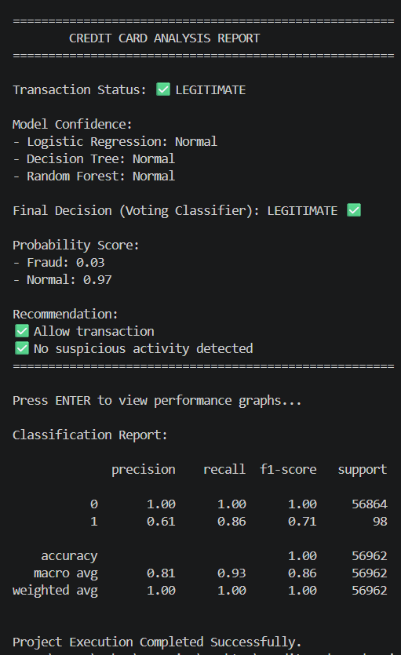

# Credit Card Fraud Detection using Voting Classifier

## Project Overview
This project detects fraudulent credit card transactions using Ensemble Learning techniques.

## Algorithms Used
- Logistic Regression
- Decision Tree Classifier
- Random Forest Classifier
- Voting Classifier

## Technologies
- Python
- Pandas
- NumPy
- Scikit-Learn
- Matplotlib
- Seaborn

## Output Screenshots

### Terminal Output

### Accuracy Graph

### Confusion Matrix

### ROC Curve

## Dataset

Credit Card Fraud Detection Dataset:

https://www.kaggle.com/datasets/mlg-ulb/creditcardfraud

## Author
Anbuselvan# Credit-Card-Fraud-Detection
Credit Card Fraud Detection using Voting Classifier (Ensemble Learning)
